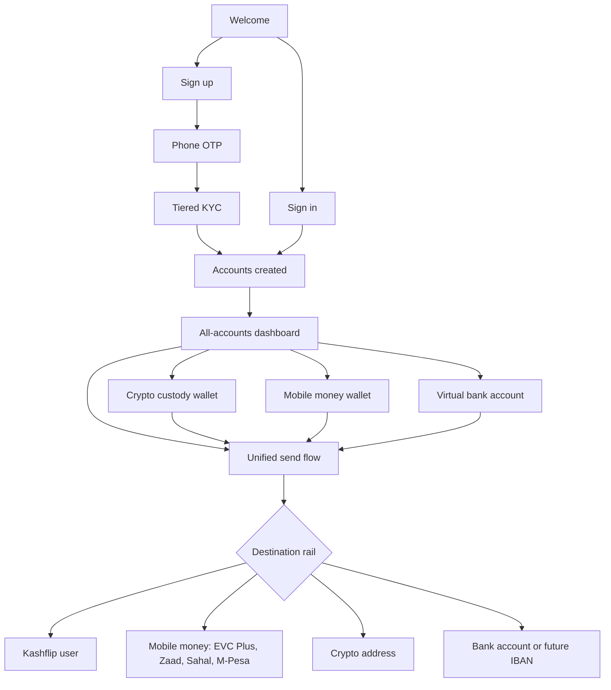

# Kashflip Phase 1 User Flow

## Phase 1 App Screens

- Welcome
- Sign up
- Sign in
- OTP verification
- Tiered KYC
- Dashboard with crypto custody, mobile money and virtual bank balances
- Account detail for each money identity
- Unified send flow across internal wallet, mobile money, crypto and bank rails
- Profile and compliance status
